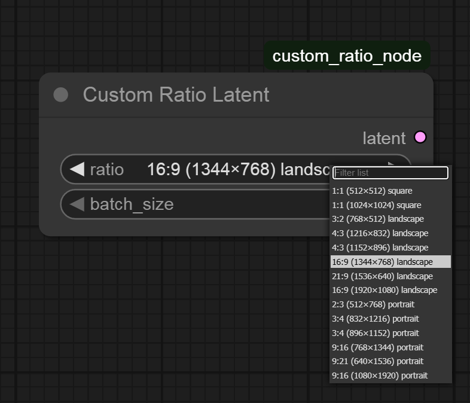

# Custom Ratio Latent Node for ComfyUI

A simple and efficient ComfyUI custom node that replaces the default "Empty Latent Image" node with predefined aspect ratios and resolutions optimized for AI image generation.

## 🎯 Features

- **Predefined Resolutions**: No more manual width/height input needed
- **Clear Aspect Ratios**: Choose from common ratios (1:1, 16:9, 9:16, 4:3, etc.)
- **Multiple Resolutions**: From 512×512 to 1920×1080 and their variants
- **Orientation Labels**: Clearly marked as landscape, portrait, or square
- **Batch Size Support**: Generate multiple latents at once
- **Direct Replacement**: Drop-in replacement for Empty Latent Image node

## 📋 Available Resolutions

### Square Ratios
- `1:1 (512×512) square`
- `1:1 (1024×1024) square`

### Landscape Ratios
- `3:2 (768×512) landscape`
- `4:3 (1216×832) landscape`
- `4:3 (1152×896) landscape`
- `16:9 (1344×768) landscape`
- `21:9 (1536×640) landscape`
- `16:9 (1920×1080) landscape`

### Portrait Ratios
- `2:3 (512×768) portrait`
- `3:4 (832×1216) portrait`
- `3:4 (896×1152) portrait`
- `9:16 (768×1344) portrait`
- `9:21 (640×1536) portrait`
- `9:16 (1080×1920) portrait`

## 🚀 Installation

1. Download the `custom_ratio_node.py` file
2. Place it in your ComfyUI custom nodes directory:

    ComfyUI/
    ├── custom_nodes/
    │   └── custom_ratio_node.py  ← Place the file here
    └── ...

🤝 Contributing
Feel free to suggest additional resolutions or improvements by opening an issue or pull request.
📝 License
This project is open source. Feel free to use, modify, and distribute as needed.

## 🔗 Compatibility

- **ComfyUI**: Latest version
- **Models**: Stable Diffusion 1.5, SDXL, Flux
- **OS**: Windows, macOS, Linux
